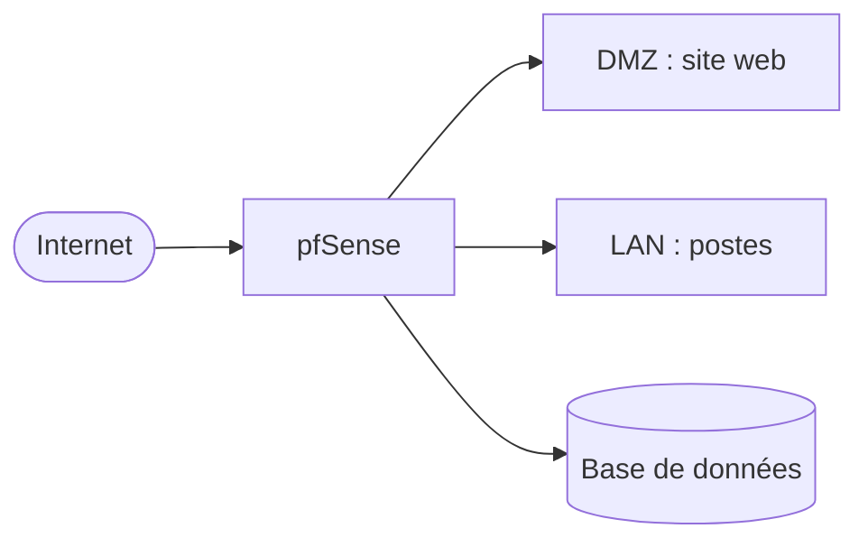
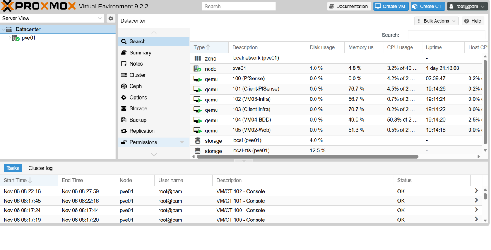

# Schéma des zones

```mermaid
flowchart LR
I([Internet]) --> FW[pfSense]
FW --> DMZ[DMZ : site web]
FW --> LAN[LAN : postes]
FW --> BDD[(Base de données)]
```
Le pare-feu est le seul passage entre les zones.
